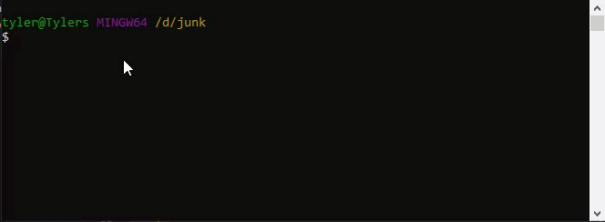
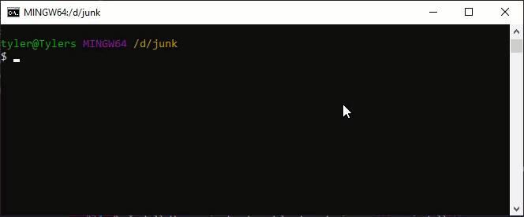
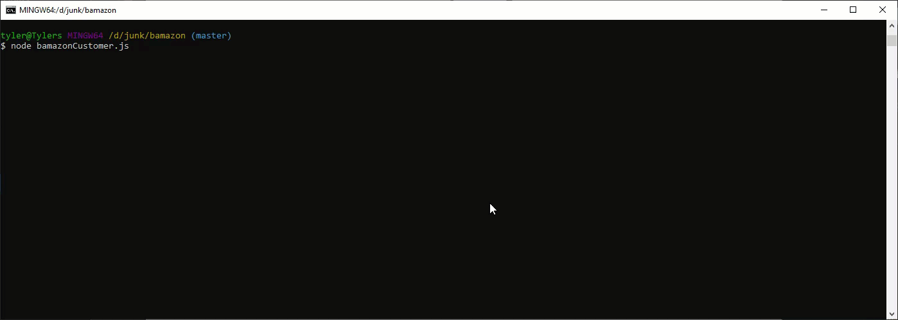

<div align ="center"><h1>Bamazon-node-app</h1></div>

Bamazon is a node command line application that allows a user to select an item available on the Bamazon and select the quantity they would like to order. Furture updates are to include a bamazon management and bamazon supervisor applications. Bamazon Management allows a user to view products for sale, update inventory, view low inventory, and add a new product. Bamazon Supervisor allows a user to view product sales by department and create new departments

## Table of Contents

[**Installation**](#installation)

[**Execution**](#execution)

[**Node Modules**](#Node-Modules)

## Installation ##
1. Clone the repository to your computer using ```git@github.com:tylerblakeman/bamazon.git```<p>
<p>
2. Use ``cd bamazon`` to open the bamazon directory, and enter ``npm-install`` to install the required dependencies.<p>
<p>
3. Copy the bamazon_seed.sql contents into your mysql workbench and execute to create your bamazon mySQL database.<p>
<p>
4. Update bamazon files to reflect your mySQL password.<p>
<p>

## Execution ##
5. Execute bamazon by entering ``node bamazonCustomer``, ``node bamazonManager``, or ``node bamazonSupervisor``<p>
<p>

[Table of Contents](#Table-of-Contents)

## Additional Info ##
### Node Modules ###
This application uses the following Node Modules:
* [mysql](https://www.npmjs.com/package/mysql)
* [inquirer](https://www.npmjs.com/package/inquirer)

[Table of Contents](#Table-of-Contents)